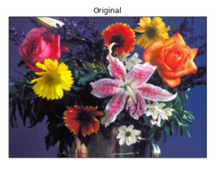
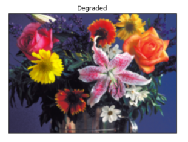
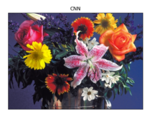
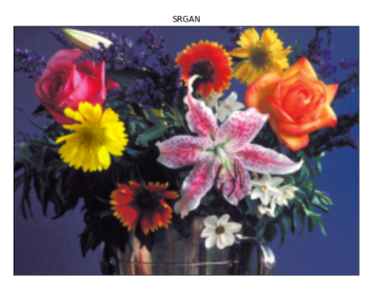
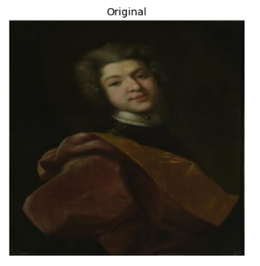
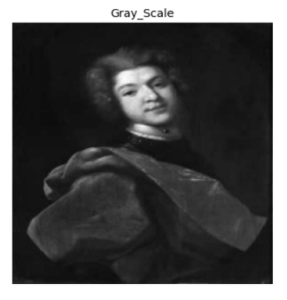
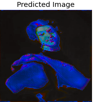
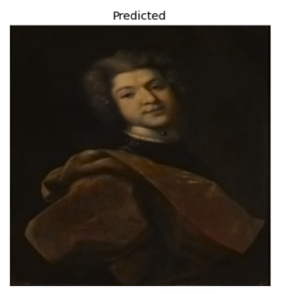

# Image_Reconstruction_Using_Neural_Networks

## Dataset and Weights

Dataset and pretrained weights can be downloaded from the below link:
https://drive.google.com/drive/folders/1HkLLwXzC4tPIryB7razMID4x8SBMx9Mx

## Tools Used
* [NumPy](https://numpy.org/) 
* [Matplotlib](https://matplotlib.org/) 
* [Scikit-Learn](https://scikit-learn.org/stable/) 
* [OpenCV](https://opencv.org/) 
* [Keras](https://keras.io/) 
* [Skimage](https://scikit-image.org/)
* [Tensorflow](https://www.tensorflow.org/)

## Neural Network Models
* Convolutional neural network 
* Generative adversarial networks
* Autoencoder

## Results

### Low Quality to High Quality

|||||
|:---:|:---:|:---:|:---:|
|**Orginal**|**Degraded**|**CNN**|**GAN**|

### Grey scale to Colorized

|||||
|:---:|:---:|:---:|:---:|
|**Orginal**|**Greyscale**|**CNN**|**Autoencoder**|

