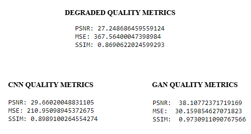

# Image Reconstruction Using Neural Networks

Image reconstruction refers to converting a low-quality image to high-quality, restoring the color of an image from its gray-scaled image. Degradation of images may occur during image transmission, storage, etc. This project has been implemented to improve the quality of an image for visual perception of human beings. 
A deep-learning based model has been developed which provides better solution to get optimized images. Firstly, the **Convolutional Neural Network model (CNN)** has been been built which designs a fully automatic system to produce high-quality realistic colorization and to reconstruct high-quality images from low-quality images. To evaluate the performance of this model, three image quality metrics has been used. One of the datasets has high-quality images which has been converted as low-quality images using OpenCV. Another dataset which has colorised images has been converted as gray-scale images using OpenCV. Once the CNN models were built, they were trained. After training process has been completed, the models were tested with various images and the results were observed. To improve the results, **Autoencoder (for Colorization) and (GAN) Generative Adversarial Network (for Image Quality Reconstruction)** models have been used and a comparison between CNN and these new models can be seen below.

## Dataset and Weights

Dataset and pretrained weights can be downloaded from the below link:
https://drive.google.com/drive/folders/1HkLLwXzC4tPIryB7razMID4x8SBMx9Mx

## Tools Used
* [NumPy](https://numpy.org/) 
* [Matplotlib](https://matplotlib.org/) 
* [Scikit-Learn](https://scikit-learn.org/stable/) 
* [OpenCV](https://opencv.org/) 
* [Keras](https://keras.io/) 
* [Skimage](https://scikit-image.org/)
* [Tensorflow](https://www.tensorflow.org/)

## Neural Network Models
* Convolutional neural network 
* Generative adversarial networks
* Autoencoder

## Results

### Low Quality to High Quality

|||||
|:---:|:---:|:---:|:---:|
|**Orginal**|**Degraded**|**CNN**|**GAN**|

### Quality Metrics

  

### Grey scale to Colorize

||||
|:---:|:---:|:---:|
|**Orginal**|**Grayscale**|**Autoencoder**|
